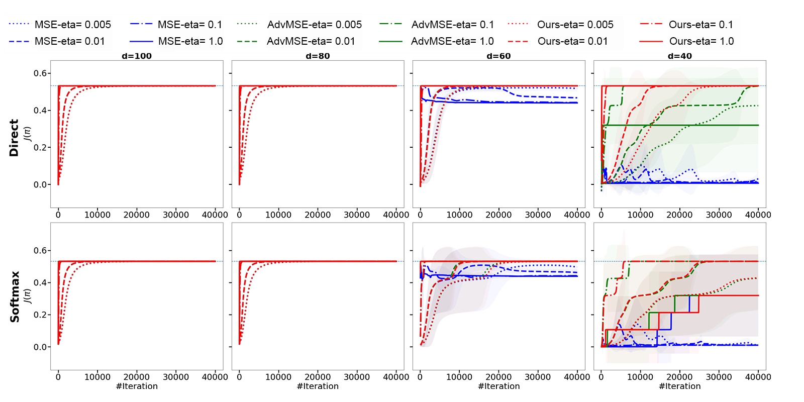

# ACPG

This repository contains implementations of actor-critic algorithms described in the paper _Decision-Aware Actor-Critic with Function Approximation and Theoretical Guarantees_ (https://arxiv.org/abs/2305.15249) on two grid-world environments. To run the algorithms, please install the required packages and execute the following commands.



## Installation
* Create a virtual environment using python 3.

`virtualenv -p python3 <envname>`

* Activate the virtual environment.

`source envname/bin/activate`

* Clone the repo, and install the necessary python packages with `requirements.txt` file.

`pip install -r requirements.txt`

## Running the code
To execute the algorithms, run main.py with the corresponding arguments 
* You can use methods on two grid-world environments, Cliff World (CW) and Frozen Lake (FL), which you can specify with the `--env` argument.

* You can use three critic algorithms: MSE (squared loss functions for Q), AdvMSE (squared loss functions for A), and ACPG (decision-aware loss functions), which you can specify with the `--critic_alg` argument.

* You can use two functional representations: direct and softmax, which you can specify with the `--representation` argument.

* You can use two parameterizations for actor policy: linear or tabular, which you can specify with the `--actor_param` argument.

* You can also choose to use the true MDP or sample using Monte Carlo, which you can determine with the `--sampling` argument.

For instance, the following command runs ACPG method on Cliff World environment with a linear actor (d=80) with direct representation, and the agent samples using Monte Carlo:
```
python -u main.py \
--env "CW" \
--sampling "MC" \
--critic_alg "ACPG" \
--representation "direct" 
--actor_param "linear" \
--critic_d 80
```

